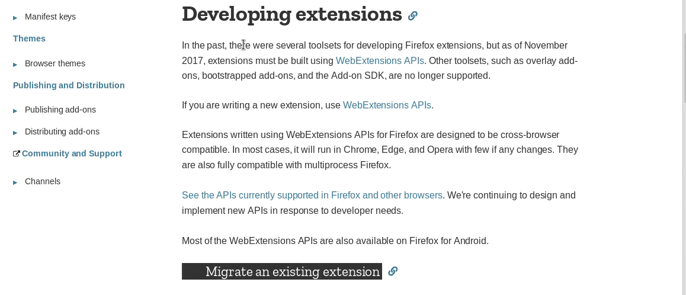
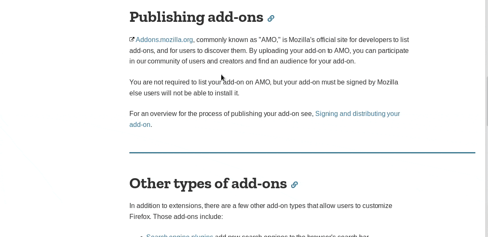
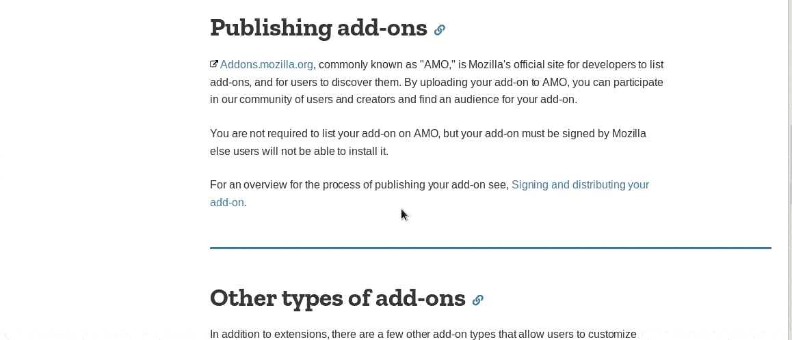

 

# 2019 @ Febrero/25  - Actualización del Traductor Elinv en Google
## Traductor de Google por Elinv

✅**Version 3.5**

- Al inicializarse la extensión, quedará con idioma destino
  el del lenguaje del Navegador => "Browser languaje"
- El idioma origen siempre será autodetectado por el traductor de Google.
- Si se desea el idioma local, en las opciones se debe seleccionar 
  y grabar la opción "Browser languaje"
- Se ha corregido un bug que impedía reconocer inmediatamente
  el nuevo lenguaje destino cuando se cambiaba a traves de la
  página de opciones.
- Se ha optimizado el código, tratando de hacerlo mas intuitivo.
- Se ha tratado de viabilizar la ayuda para traducir, 
  queriendo intentar lograr que nada sea una complicación al 
  momento de usar esta extensión.
- Falta: tenemos algunas ideas que iremos implementando.
- Gracias!
- Saludos.
- Elinv.

---

✅**Versión 3.0**
- Agregado funcionalidad para traducir desde y hacia input e iframe.

Ver ayuda en about:addons

[Conocé a Elinv: su obra y su corazón]
(https://www.google.com.ar/?gws_rd=ssl#q=elinv)

👍 Gracias!

🛠️ Errores, sugerencias, ideas, envialas a nuestro mail: <elinv.elinv@gmail.com>

## 	Demo

